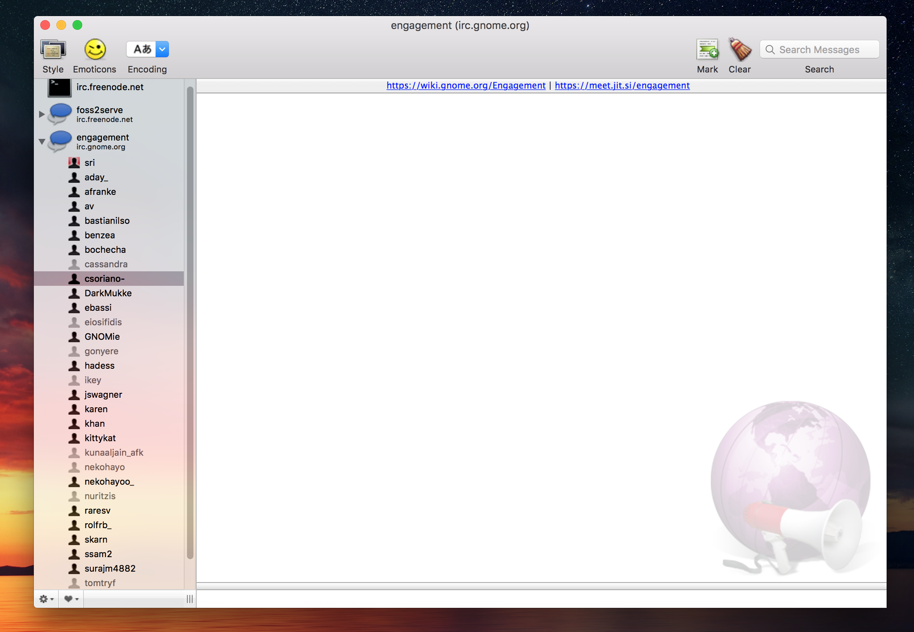

# Lab 11 (Extra Credit)

## P1

* Part 1
   * (Install IRC Client) 

* Part 2
   * The IRC channel community for the MouseTrap project functions very similarly to how communities function on Slack. Similar to Slack they have set up many different channels (docs, bugs, etc.) that make it easier to find what you are looking for and help keep the chat from becoming disorganized. People seem to use the IRC channel to mainly ask questions and provide updates.

## P2
 * RCOS Slack community
   * The RCOS slack community contains many channels. Each project generally has its own channel. However, the most important channels are "General", "Slides", and "Proposals". The most active channel appears to be the "Proposals" channel where people post slide/documents detailing a potential project that they would like to do. Overall the RCOS community appears to be be very helpful and welcoming.

## P3
   * Part 1
      * The IRC channel that the website suggested did not have any activity so I decided to use the Python IRC channel to make my observations. The main Python sub-channel has about 1800 users and thus tends to be rather hard to navigate. The Python channel is so active that people have actually created sub-channels to keep things organized. People in the main python channel generally refer new comers to another sub-channel that can best address whatever their concern is. For example there is sub-channel for developers who are new to Python. Members of this channel typically ask questions on how to do a particular thing in Python. In addition, some people also post links to things relating to Python they found useful.

   * Part 2
      * I used Titan Pad. Its very similar to Google Docs. Just not as versatile. A lot of people seem to be using is because told to through this very assignment.
   * Part 3
      * I personally believe that the most effective type of communication among developers is done face to face. Preferably in front of a white board. However, logistically speaking, this isn't always easy to do. Thats where chat tools like Slack and Hipmunk come into play. However there are many more tools that are available for things that require more complexity than simply chatting. For example there is a free online tool called Invision that allows UI designer to work together in a collaborative environment. It claims to be "The world's leading prototyping, collaboration, and workflow platform". It is being used by many popular companies including Netflix, Uber, and Twitter. Invision is just one example how the rapid advancement in web technology today is enabling new methods of communication that allow people to be more productive.

   * Part 4
      * Synchronous and asynchronous communication.
         * An example of synchronous communication would be calling someone on the phone and waiting for them to pick up the phone to have a conversation with them. However, asynchronous communication would similar to writing a letter and sending it to the person. In this case you do not wait for the person to read your letter. You carry on with your life. Eventually the person reads the letter and responds.

      * Individual interaction with group interaction.
         * Individual interactions seem to be more affective depending upon the person. The are better for dealing with more of the nitty gritty details of a project. Group interactions are better for brain storming and problem solving. However, things can get out of hand depending on the size of the group.

      * Social concern raised by collaborative software.
         * One of the largest concerns raise by the increase in social collaboration is that sometimes people tend to feel like they lose ownership of their work. An individuals contributions can become lost during the collaborative process.

      * Software that embodies human intention.
         * One of the fastest growing issues that is rising due to software and embodies human intention is addition/reliance. Dating apps, like Tinder, are a perfect example how software is full filling the human need to find a partner. People tend to become to addicted and reliant on these types of dating apps.

## Part 4
   * Coding style is something that is unique to every programmer. However, when working in a team it is very import to have a consistent coding style that every programmer is required to follow. It is very important to realize that the code you write will looked at by many other developers. Additionally it will eventually be maintained by someone other than you. Having interned at two companies I know first hand how good coding style can make it easier to be more productive. Navigating your way through a huge codebase to understand how a particular feature works it much easier when all the code has a similar format/style.
   
