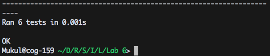

# Project Selection

## Channel
- This project no longer exists.

## Technics Plugin
- Number of Contributors: 2
- Lines of code: 87552
- First Commit: Sep 8, 2015
- Last Commit: Nov 20 , 2015
- Only one branch: master

## Suggestr
- Number of Contributors: 3
- Lines of code: 72808
- First Commit: Sep 3, 2015  
- Last Commit: Mar 8, 2016
- Only one branch: master, develop, error-check, local

## Pandamonium
- Number of Contributors: 2
- Lines of code: 30841
- First Commit: Sep 9, 2015 Msg: "Initial Commit"
- Last Commit: Feb 28, 2016 Msg: "Fixed getPrefixLength()"
- Only one branch: master


## Opinionated
- Number of Contributors: 2
- Lines of code: 23894
- First Commit: Sep 1, 2015 Msg: "Yo"
- Last Commit: Dec 3, 2015 Msg: "Added article page/sidebar/etc."
- Branches: master, connor-develop, develop-alchemy, develop, jon-develop, sam-develop, theo-develop

# Gitstats

- Number of lines is different from part1
- Number of contributors is different from part1

## Opionated
- Total Lines: 6367
- Contributors: 3

## Pandamonium
- Total Lines: 28115
- Contributors: 3

## Suggestr
- Total Lines: 65494
- Contributors: 8

##TechnicsPlugin
- Total Lines: 35666
- Contributors: 3


# Streaming Contribution Videos
## Gource Video Links
[Channel](This project no longer exists)
[Pandamonium](https://www.youtube.com/watch?v=CmF96Na0fHo&feature=youtu.be)
[Opinionated](https://www.youtube.com/watch?v=IWqekdthLo0&feature=youtu.be)
[TechnicsPlugin](https://www.youtube.com/watch?v=VgI6_04sEPI&feature=youtu.be)
[Suggestr](https://www.youtube.com/watch?v=xo9K4BjSZQ8&feature=youtu.be)

# Unit Testing

### Input
```
# Master Heading
## This is a smaller sub-heading
### This is an even smaller heading

> This a blockquote
> # Heading inside the quote
> Blah blah

```

### Output

```
<h1>Master Heading</h1>
<h2>This is a smaller sub-heading</h2>
<h3>This is an even smaller heading</h3>

<blockquote>
This is a blockquote
<h1>Heading inside the quote</h1>
Blah blah
</blockquote>
```

### Unit Tests Passing

