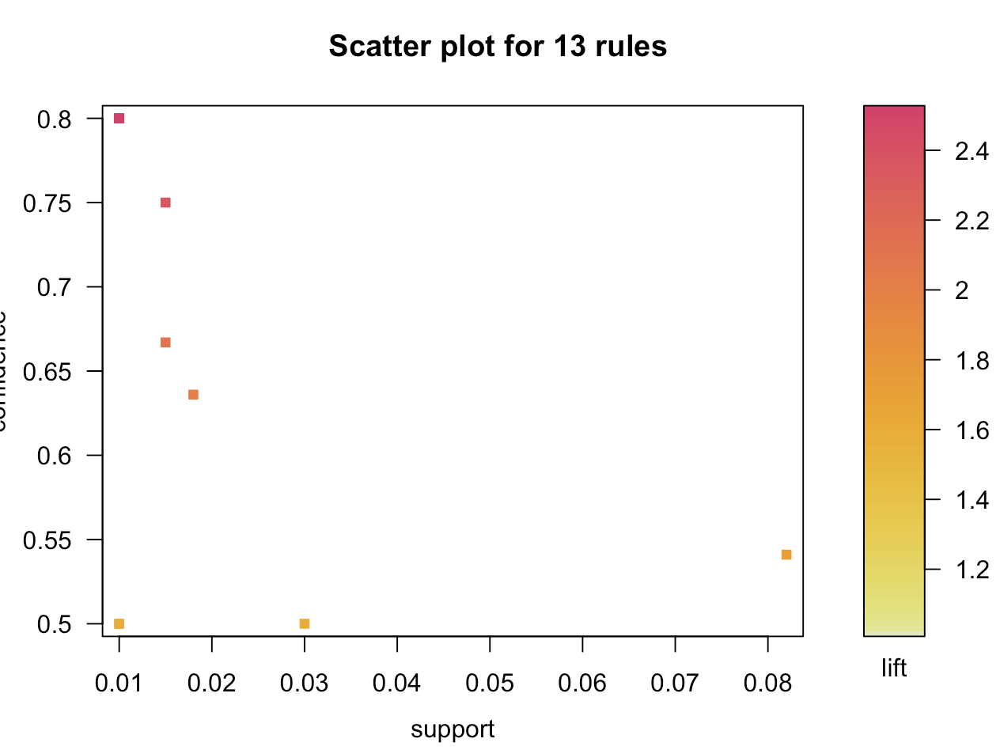
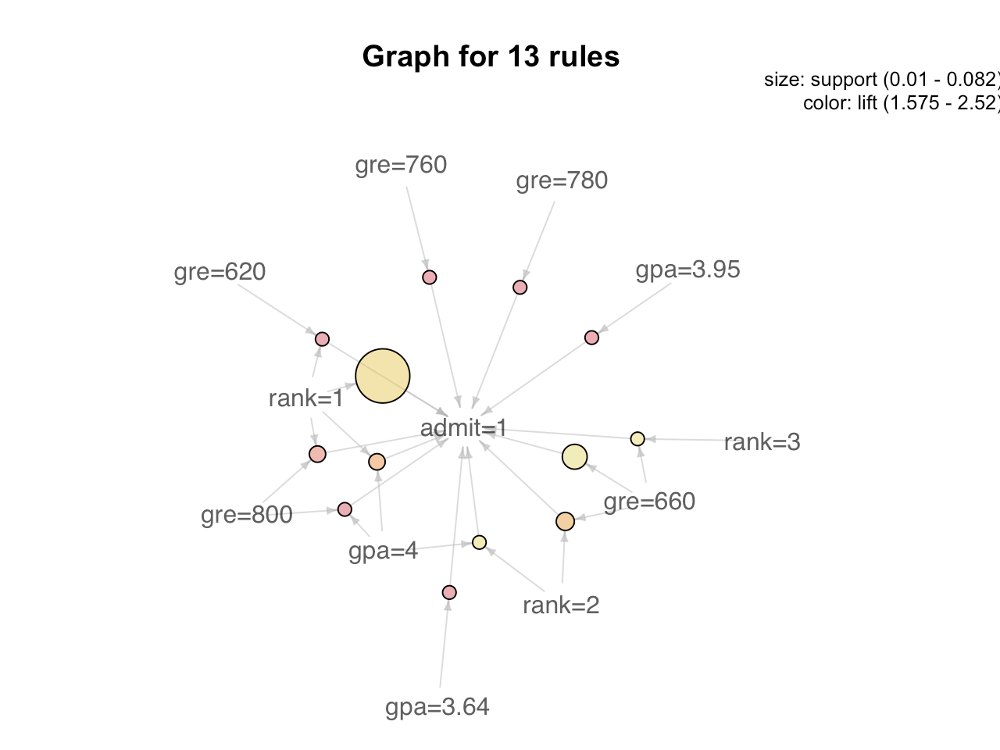
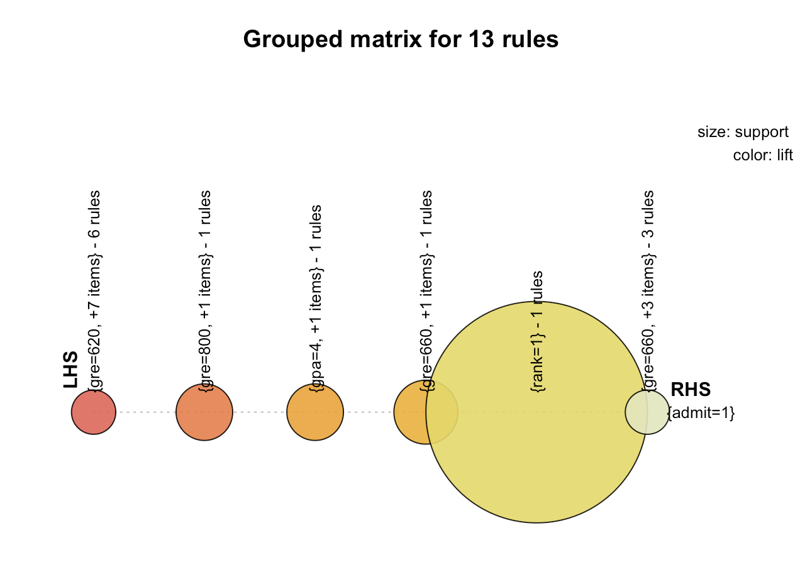

## Lab 8: Statistical Computing/Open Data/Data Science/Machine Learning

#### R Script
```
str(binary)

col_names <- names(binary)
binary[,col_names] <- lapply(binary[,col_names] , factor)

library(arules)
library(arulesViz)

# Generate rules using apriori()
rules.all <- apriori(binary, parameter=list(support=0.01, confidence=0.5))
inspect(rules.all)

# Rules when when people are admitted
rules.all <- apriori(binary,
                     parameter = list(support=0.01, confidence=0.5),
                     appearance = list(rhs = c("admit=1"), default="lhs"))

# Keep to three decimal places
quality(rules.all) <- round(quality(rules.all), digits = 3)

# Remove redundant rules
subset.matrix <- is.subset(rules.all, rules.all)
subset.matrix[lower.tri(subset.matrix, diag = T)] <- NA
redundant <- colSums(subset.matrix, na.rm = T) >= 1
rules.pruned <- rules.all[!redundant]

inspect(rules.pruned)

# Visulize the rules

plot(rules.all)
# plot(rules.all, method = "grouped")
# plot(rules.all, method = "graph")

# Rules when when people are not admitted
rules.all <- apriori(binary,
                     parameter = list(support=0.01, confidence=0.5),
                     appearance = list(rhs = c("admit=0"), default="lhs"))

inspect(rules.all)
```

#### Rules Visualizations







### Course Project Update

My team and I are going to be working Atom. Atom is an open source text editor created by Github. We have decided that we are going to be making a few extensions that we feel would be useful. In addition, if time permits, we would also like to try and resolve any issues that are listed for Atom Core. We spent the better part of last week becoming familiar with the tech stack that is used to develop extensions for Atom. In addition we also carved out some time to get familiar with Atoms's codebase. Lastly we had a meeting on 4/6 where we discussed the extensions we would like to make. As of now we will be building an extension that actively checks for memory leaks within your code. Another one allows you to select multiple words within a file and find all the occurrences of them in that order. This is a feature that is implemented in Sublime Text.
